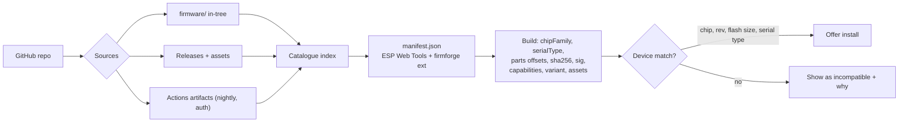
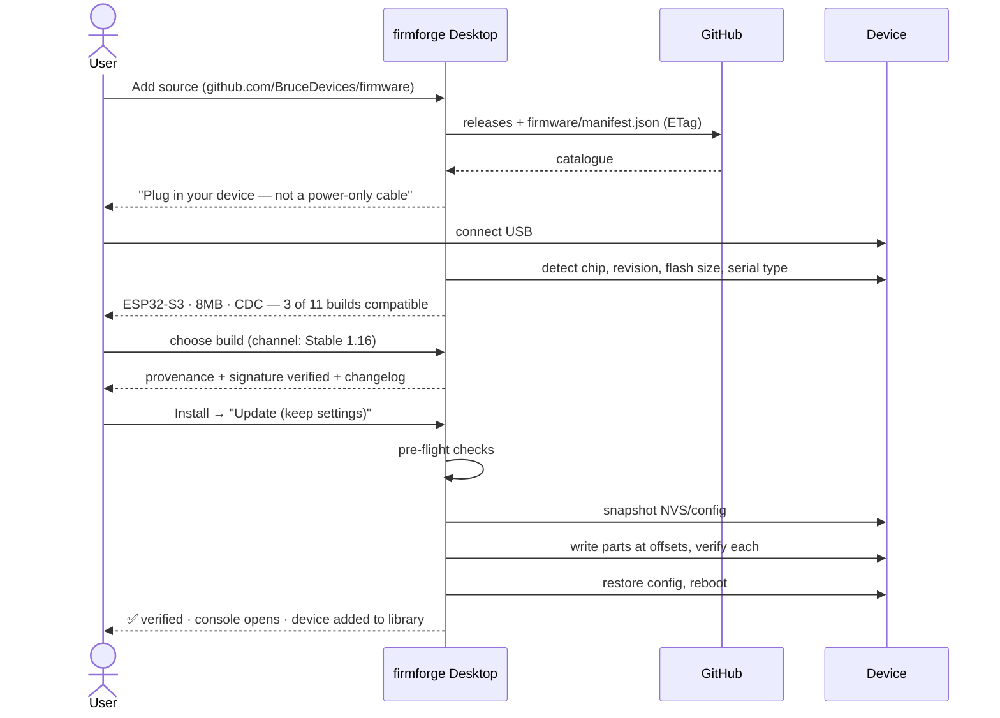

# firmforge — Product Specification v1.0

**Status:** Draft for build · **Date:** 2026-08-01 · **Owner:** apurv123
**Inputs:** [`product-research/`](product-research/) (7 competitor teardowns, 52 screenshots, reaction-ranked user demand) · [`pm-requirements.md`](pm-requirements.md) (technical constraints, verified against crates.io and vendor docs)

---

## 1. One-liner

> **firmforge turns any GitHub repository into a firmware store — and any ESP32 device into something you can safely install, update, roll back and talk to, from your desktop or your phone.**

---

## 2. Problem

Getting community firmware onto an ESP32-class device is a solved problem exactly once: the first flash, on a desktop, in Chrome. Everything after that falls apart.

Evidence from the research:

| Observed reality | Source |
|---|---|
| The most popular firmware in the category (Marauder, 11.8k★) has **no flasher at all** — its GitHub Pages URL 404s and users self-select from a large ambiguous `.bin` matrix | `esp32-marauder/` |
| The resulting support load is distribution failure, not firmware failure: *"flipper_sd_serial compiled version not working"* (8👍), *"empty PCAP on my board"* | `esp32-marauder/` |
| Installing an app or theme means **physically removing the SD card** and copying files into `/Bruce/` | `bruce-firmware/07-app-store.png` |
| Users explicitly asked for a **"Full-Featured Mobile App (Control, App Store, Settings)"** — unbuilt | Bruce issues |
| Users asked their mobile app to **"warn users of old firmware version"** (13👍) and to **"keep favourites when NodeDB is reset"** (14👍) | Meshtastic-Android |
| Upgrading broke things and **reverting fixed it** (12👍) | esphome core |
| Every browser flasher is capped by WebSerial: Chrome/Edge desktop only, **no mobile browser on any platform**, plus unfixable "Chrome crashes", "serial port is not ready", fixed baud rate | `esp-web-tools/` |
| Trust is a checkbox ("Only Official") or a folk heuristic ("official builds are uploaded by *owner* and have photos") | `m5burner/`, Bruce README |
| **Nobody verifies a signature.** Every tool in the set will happily flash an unsigned binary from a CI artifact | all |

**The gap in one sentence:** the industry solved *the flash*; nobody owns *the device relationship*.

---

## 3. Strategy

Three bets, each traceable to the research:

1. **Be the client where the browser cannot go.** WebSerial's limits are structural. A native Rust app is immune to them and is the *only* possible answer on a phone. → §5, §7
2. **Speak the ecosystem's existing language.** Consume ESP Web Tools `manifest.json` verbatim, so firmforge installs Bruce, ESPHome and vendor firmware on day one without anyone's cooperation; emit it too, so firmforge-published firmware also works in a browser. → §6
3. **Win on the second week, not the first minute.** Update notifications, config snapshots, verified provenance, one-tap rollback, device history, a real console. Nobody has these. → §8

**Non-goals for v1:** compiling firmware from source (ESPHome owns that); being a hardware vendor; hosting binaries (GitHub already does); shipping offensive tooling ourselves (we are a neutral manager — see R-SEC-7).

---

## 4. Users

| Persona | Wants | Where they are | Primary client |
|---|---|---|---|
| **Ana, the tinkerer** | Bought a Cardputer, wants Bruce on it tonight without reading a wiki | At a desk, USB cable | Desktop |
| **Ben, the field operator** | Ten nodes deployed; needs to check versions and push an update on site | On a rooftop, no laptop | **Mobile** |
| **Cara, the firmware author** | Her repo's users to stop opening "wrong .bin" issues | GitHub Actions | Repo convention + desktop |
| **Dev, the security researcher** | Multiple boards, multiple builds, wants to switch fast and not lose configs | Desk, many devices | Desktop |

---

## 5. The two applications

### 5.1 firmforge Desktop — *"the workbench"*

**Windows · macOS (Intel + Apple silicon) · Linux (X11 + Wayland) · Tauri v2 · < 20 MB installer**

> A firmware workbench. Point it at GitHub repositories, plug in a board, and it identifies the chip, shows only the builds that fit, tells you where each binary came from and whether it verifies, then installs it — keeping a snapshot of your settings and a way back to the last build that worked. Afterwards the device stays in your library with its console, its files, its config and its history.

Owns: first flash, bulk/repeat flashing, deep console work, file management, everything destructive, everything requiring a cable.

### 5.2 firmforge Mobile — *"the field kit"*

**Android (Play + F-Droid + direct APK) · iOS (App Store + TestFlight) · Tauri v2 mobile**

> The device you flashed, in your pocket. See every device you own, whether its firmware is current, and what changed in the release you haven't installed yet. On Android, flash over a USB-OTG cable with no computer at all. On both platforms, connect over Bluetooth to read the console, change settings, back up config and push OTA updates to firmware that supports it.

Owns: staleness notifications, in-field updates, BLE console/config, provisioning, quick reference (download-mode instructions, pinouts).

**Honest platform split — stated in the product, not hidden:**

| Capability | Desktop | Android | iOS |
|---|---|---|---|
| USB serial flashing | ✅ | ✅ (USB-OTG, native plugin) | ❌ *impossible — no MFi* |
| BLE OTA update | ✅ | ✅ | ✅ |
| BLE console & config | ✅ | ✅ | ✅ |
| Catalogue browsing | ✅ | ✅ | ✅ |
| Update notifications | ✅ | ✅ | ✅ |
| Device file manager | ✅ | ✅ | ⚠️ BLE only (slow) |
| Config backup/restore | ✅ | ✅ | ✅ |

---

## 6. Data model & repository convention



**Core entities**

- **Source** — a GitHub repo the user has added (owner/repo, ref, channel prefs, ETag cache, auth requirement).
- **FirmwareRelease** — version, channel (stable/beta/nightly), published date, changelog, provenance (tag, commit SHA, workflow run).
- **Build** — one installable variant: `chipFamily`, optional `serialType` (cdc|uart, absent = fallback), ordered `parts[{path, offset, sha256}]`, `capabilities[]`, `variant` + what it drops, `assets[]` (SD/LittleFS payloads with target paths), constraints (`minFlashSize`, `psramRequired`, `minChipRevision`), `otaSupported` + protocol.
- **Device** — a remembered physical board: chip family + revision, flash size, MAC (stable identity), user-given name, attached modules (CC1101, NRF24, IR…), installed build, install history, config snapshots, transport (USB / BLE).
- **InstallJob** — resumable, cancellable, per-part progress, pre-flight results, verification result.

The repository convention (`firmware/manifest.json` + `builds/` + `boards/`) is specified in [`pm-requirements.md` §2.5](pm-requirements.md). **It is an optimisation, never a requirement** — a repo that does nothing still works via Releases + chip detection heuristics.

---

## 7. Feature set

### 7.1 v1 — Desktop (must ship)

| # | Feature | Origin |
|---|---|---|
| F-01 | Add a source by GitHub URL; auto-discover firmware in `firmware/`, Releases, or both | new |
| F-02 | **Release-channel selector** (Stable / Beta / Nightly) with release date shown inline | Bruce flasher |
| F-03 | **Chip auto-detection** → catalogue filtered to compatible builds only; incompatible items shown greyed **with the reason** | ESP Web Tools + Flipper compatibility gating |
| F-04 | **Manufacturer → device drill-down** with board artwork | Bruce; M5Burner left rail |
| F-05 | **Per-device download-mode instructions** rendered at the moment of need, with illustrations | Bruce (highest-value content on their site) |
| F-06 | **Power-only-cable warning** shown *before* connect | Meshtastic |
| F-07 | **Update vs Erase & install clean**, described by consequence | Meshtastic; ESP Web Tools |
| F-08 | **Pre-flight checks** that block with a plain-language reason (chip mismatch, flash too small, no SD card, low battery, no space) | qFlipper "block update if no SD card" |
| F-09 | **Config snapshot before every write**, restore after | Meshtastic "keep favourites"; M5Burner export |
| F-10 | **SHA-256 verification of every part** + optional **Ed25519 signature** with TOFU key pinning | nobody does this |
| F-11 | **Provenance panel**: repo, owner, tag, commit, workflow run, build time, verification badge | nobody does this |
| F-12 | Multi-part writes at correct offsets; high-baud negotiation; compressed writes; verify-after-write | espflash |
| F-13 | **Serial console** as a permanent pane: baud selector, timestamps, save log, ANSI, filter | Marauder CLI; Meshtastic monitor |
| F-14 | **Device library** with history and **one-tap rollback to last known-good** | esphome "reverting fixed it" |
| F-15 | **Asset installation** — SD/LittleFS payloads pushed in the same session, no card removal | Bruce App Store's manual copy |
| F-16 | **Offline mode**: content-addressed cache; browse, flash, roll back with no network and no account | new |
| F-17 | Driver/permission doctor: detect CH34x/CP210x/FTDI binding, Linux `dialout` permission errors, offer the exact fix inline | Bruce `setfacl` note; universal pain |
| F-18 | Trust filter: *Verified publishers only* — signature-backed, not self-asserted | M5Burner "Only Official", done properly |
| F-19 | i18n + light/dark from v1 | ESP Web Tools' top open ask; Meshtastic ships it |
| F-20 | Local file sideload (`.bin`, release `.zip`, manifest URL) | Meshtastic |

### 7.2 v1.1 — Mobile

| # | Feature | Origin |
|---|---|---|
| F-21 | **Firmware staleness notifications** from watched repos, with changelog | Meshtastic-Android 13👍 |
| F-22 | **Android USB-OTG flashing** via native Kotlin USB-host plugin | the unserved gap |
| F-23 | **BLE OTA update** (iOS + Android) for OTA-capable firmware | Flipper's killer feature |
| F-24 | **BLE console + config editor** | Meshtastic |
| F-25 | WiFi provisioning via improv-serial / improv-BLE right after install | ESP Web Tools |
| F-26 | Offline field reference: download-mode instructions, pinouts, board photos | Bruce content, made portable |
| F-27 | F-Droid + direct APK distribution; telemetry off by default; no location permission for BLE where avoidable | Meshtastic 15👍 + privacy asks |

### 7.3 v2 — the moat

| # | Feature |
|---|---|
| F-28 | **Device workspace with left rail** — Overview / Firmware / Files / Console / Config / History | Flipper Lab |
| F-29 | **Fleet view**: many devices, version drift, staged rollout, "update all" |
| F-30 | **Catalogue publishing**: `firmforge publish` GitHub Action that emits a signed, ESP-Web-Tools-compatible manifest from CI |
| F-31 | **App/asset store** across sources, gated on installed-firmware compatibility |
| F-32 | Scripting/automation (headless CLI sharing the same core) for labs and classrooms |
| F-33 | Public reaction-ranked feature-request repo as roadmap input | ESPHome's model |

---

## 8. Workflows

### 8.1 W1 — First install (desktop, the hero flow)



**Failure branches, all designed:** no port → driver doctor (F-17); permission denied on Linux → inline udev/`setfacl` fix; chip mismatch → why + what fits; write fails → resume or enter ROM recovery, with "you cannot brick this device" reassurance; verify fails → do not mark installed, offer retry/rollback.

### 8.2 W2 — Update (desktop or mobile)
Watched repo publishes → notification with version + changelog highlights → open → *diff strip*: installed 1.15 → available 1.16, capability changes, breaking-change flags → Update (keep settings) → snapshot → write → verify → **"Roll back to 1.15" stays available for 30 days**.

### 8.3 W3 — Field update (mobile, Android)
On site → open firmforge → device shows **Outdated** → plug USB-OTG cable (or connect BLE) → app warns if bus power looks insufficient → Update → verified write → console confirms boot. **No laptop.**

### 8.4 W4 — Install an app/theme/asset
Browse catalogue → item shows compatibility with the *installed build* → Install → files written to SD/LittleFS over the existing connection at the manifest's declared target paths → appears in the device menu. (Compare: Bruce requires removing the SD card.)

### 8.5 W5 — Rollback / recovery
Device misbehaving → Device → History → previous known-good build → Roll back → config snapshot from that era offered for restore.
Device unresponsive → **Recovery**: guided ROM download-mode entry per board → full erase + clean install.

### 8.6 W6 — Publish (firmware author)
Add the firmforge GitHub Action → CI builds → Action emits `manifest.json` + per-part SHA-256 + optional Ed25519 signature → attaches to the Release → users' firmforge clients see the new version within one poll, **and the same manifest powers a browser flasher for free**.

### 8.7 W7 — Bring your own repo (private)
Sign in via **OAuth device flow** → token in OS keychain → private repos and Actions artifacts become available → nightly channel appears, clearly labelled as expiring.

---

## 9. UX screens

### 9.1 Desktop

**Shell:** left navigation rail (Flipper Lab pattern) — `Library` · `Catalogue` · `Sources` · `Console` · `Settings`. Persistent bottom-left **device chip**: connected board, chip family, firmware version, transport icon.

| # | Screen | Contents |
|---|---|---|
| **D1** | **Library (home)** | Device cards: board photo, user-given name, chip + flash, installed build + channel, status pill (`Up to date` / `Update available` / `Unverified` / `Disconnected`), last seen. Empty state = "Plug in a device or add a source". |
| **D2** | **Connect / Detect** | The **Meshtastic three-step, progressively enabled** layout: ① DEVICE (port list, auto-detect, board illustration, *"ensure the cable is not power-only"*), ② FIRMWARE (source + channel + build), ③ FLASH (Update vs Erase & install clean). Steps 2–3 greyed until ① resolves. |
| **D3** | **Catalogue** | M5Burner three-pane: left rail = manufacturer → device; top = search + facet chips (`WiFi` `BLE` `Sub-GHz` `NFC` `IR` `LoRa` `Games` `Themes`) + **Verified only** toggle + channel selector; main = build cards. **Card** = artwork, name, verified badge, version dropdown, publisher, published date, size, download count, one-line description, primary action. Incompatible cards are dimmed **with the reason on the card** ("needs 16 MB flash — yours is 4 MB"). |
| **D4** | **Build detail** | Changelog, **provenance block** (repo · tag · commit · workflow run · built at · signature status), capability list, variant note (*"LITE: no SSH/WireGuard/interpreter — needed for M5Launcher compatibility"*), parts table with offsets and hashes, compatibility verdict, `Install`. |
| **D5** | **Pre-flight** | Checklist with pass/warn/block rows (chip, flash size, SD card, battery, free space, driver, permissions). Blocking rows have a **Fix** action. Below: "We'll back up your settings first" with a toggle. |
| **D6** | **Flashing** | Per-part progress with offsets, live throughput, elapsed/remaining, cancel. Then a verification step with an explicit ✅/❌ — never just "100%". |
| **D7** | **Device workspace** | Tabs: **Overview** (identity, MAC, chip rev, flash, modules) · **Firmware** (installed, available, rollback) · **Files** (SD/LittleFS browser, drag-and-drop) · **Console** · **Config** (backup/restore/diff) · **History** (timeline of installs, results, snapshots). |
| **D8** | **Console** | Baud selector, timestamps, autoscroll, filter, save, clear, send-line. Dockable beside any other screen. |
| **D9** | **Sources** | Added repos: name, stars, last checked, channels enabled, ETag/rate-limit status, verified-publisher key + fingerprint, remove. |
| **D10** | **Settings** | Language, theme, default channel, cache location + size + purge, GitHub sign-in, telemetry (off by default, explained), driver doctor, app self-update. |
| **D11** | **Recovery** | Board-specific ROM download-mode instructions with illustrations, a big reassurance line — *"An ESP32 can almost always be recovered. Nothing you do here is permanent."* — then Detect → Erase → Clean install. |

### 9.2 Mobile

Bottom tab bar: **Devices · Catalogue · Console · Settings**.

| # | Screen | Contents |
|---|---|---|
| **MS1** | **Devices** | Vertical cards, status-first: `Up to date` / `Update available · 1.16` / `Unverified`. Pull to refresh. |
| **MS2** | **Device detail** | Big status ring, firmware version, transport (USB-OTG / BLE) with signal, quick actions: Update · Console · Config · Backup. |
| **MS3** | **Update sheet** | Version diff, changelog highlights, size, verification badge, "keeps your settings" reassurance, single `Update` button, live progress that survives screen-lock. |
| **MS4** | **Connect** | Transport chooser: `USB-OTG` (Android; system permission dialog explained beforehand) or `Bluetooth` (permission rationale shown at point of use, `neverForLocation`). |
| **MS5** | **Catalogue** | Single-column cards, same facets as D3, filtered by the connected device by default. |
| **MS6** | **Console** | Mono log, tap to pause, share/export, quick-command chips. |
| **MS7** | **Field reference** *(offline)* | Per-board: photo, pinout, **download-mode instructions**, recovery steps. Works with no signal. |
| **MS8** | **Settings** | Watched repos + notification prefs, language, theme, cache, sign-in, telemetry off by default. |

### 9.3 Cross-cutting UX principles

1. **Never show a `.bin` filename as a choice.** The user picks a device and a version; the app picks the bytes.
2. **State consequences, not operations.** "Erase & install clean — your settings and files will be lost" beats "erase flash".
3. **Warn before the failure, not in the FAQ** (power-only cables, missing drivers, missing SD card).
4. **Every artifact shows where it came from and whether it verifies** — one glance, every time.
5. **Nothing is irreversible.** Snapshot, verify, roll back, recover. Say so out loud.
6. **Explain incompatibility; never hide it.** A dimmed card with "needs 16 MB flash" teaches; a missing card confuses.
7. **Offline is a first-class state,** not an error.
8. **Neutral tone.** firmforge manages firmware; it does not editorialise about what that firmware does, and it surfaces each firmware's own licence and disclaimer.

---

## 10. Architecture

```
crates/
  firmforge-core/    catalogue, GitHub client (ETag/rate-limit aware), manifest parse+emit,
                     verification (sha2, ed25519-dalek), device model, cache, install planner
  firmforge-flash/   transports: serial (serialport 4.9 + espflash 4.5 desktop),
                     android-usb (Kotlin plugin bridge), ble (btleplug 0.12), ota
  firmforge-app/     shared Tauri command surface + state machine (desktop and mobile)
apps/
  desktop/           Tauri v2 shell, updater, packaging (msi/dmg/AppImage/deb)
  mobile/            Tauri v2 mobile shell, Kotlin USB-host plugin, Swift BLE glue
ui/                  shared TypeScript frontend, responsive: rail (desktop) ↔ tabs (mobile)
```

Key dependencies (versions verified 2026-08-01): `tauri` 2.11 · `espflash` 4.5 · `serialport` 4.9 · `esp-idf-part` 0.6 · `btleplug` 0.12 · `octocrab` 0.54 · `reqwest` 0.13 · `sha2` 0.11 · `ed25519-dalek` 3.0 · `zip` 8.6.

---

## 11. Roadmap

| Milestone | Scope | Exit criteria |
|---|---|---|
| **M0 — Skeleton** | Cargo workspace, core + flash + app crates, desktop shell, CI | `cargo check` green on all crates; desktop window boots |
| **M1 — Read** | GitHub sourcing, manifest parse, catalogue UI (D3/D4), cache | Add Bruce's repo and see its real builds with provenance |
| **M2 — Write** | Chip detection, pre-flight, multi-part flash, verify, console (D2/D5/D6/D8) | Flash a real ESP32-S3 end to end, verified |
| **M3 — Live with it** | Library, history, snapshots, rollback, assets, driver doctor (D1/D7/D11) | Update → break → roll back, settings intact |
| **M4 — Trust** | Ed25519 signing, TOFU pinning, verified filter, publish Action | A signed release shows a green badge; tampering is refused |
| **M5 — Pocket** | Android USB-host plugin, mobile shell, notifications (MS1-MS4) | Flash a board from a phone with no computer |
| **M6 — Wireless** | BLE console/config + BLE OTA; iOS app | iOS updates an OTA-capable device over BLE |
| **M7 — Fleet** | Multi-device drift view, staged rollout, CLI | Update 10 devices from one screen |

---

## 12. Success metrics

| Metric | Target |
|---|---|
| First-flash success rate (added source → verified install, no docs) | > 90 % |
| Median time from app open to verified install | < 4 min |
| Share of installs that are **updates**, not first installs (device-relationship proof) | > 60 % by M4 |
| Wrong-artifact support issues | ~0 (structurally eliminated by F-03) |
| Rollbacks used at least once per active user | > 15 % (proves the safety net is real) |
| Mobile MAU / desktop MAU | > 0.5 by M6 |
| Verified-signature installs | > 50 % of installs by M5 |

---

## 13. Open questions

1. **Signing key custody** for firmware authors — TOFU only, or an optional keys registry in the repo?
2. **Catalogue discovery** — curated starter list of repos, or strictly bring-your-own? (Curation implies editorial responsibility for offensive-security firmware — see R-SEC-7.)
3. **iOS scope** — ship at M6, or defer until BLE-OTA-capable firmware is common enough to make the app worth installing?
4. **Android USB-host plugin** — build in-house or wrap an existing Java USB-serial library? Prototype first (largest single risk).
5. **App-store positioning** — how neutral must the listing be to survive review while still being findable by the Bruce/Marauder audience?
